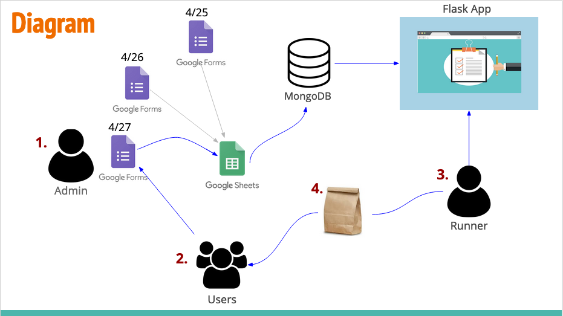

# Back-end Web Architecture Final Project

<h3>Project title</h3>
Meal Order Delivery App
 
<h3>Project Team</h3>
Victor Hsin, Allison Kuo, Brinda Gurusamy, and Max Ingraham-Rakatansky
 

<h3>Background</h3>
Given the recent news regarding Coronavirus, International House (I-House), a Berkeley residential housing community, has imposed strict rules limiting social gatherings to avoid potential spreading of the disease. To avoid contact, the dining hall and other public spaces have closed and instead students are required to collect food one by one and to avoid eating in large groups. In addition, the dining staff has requested that students feeling ill send emails to request food for delivery.
 
<h3>Proposal</h3>
Our team would like to build a web app that would allow I-House students who are self-quarantining to request meals from the dining hall. Dining hall workers would be able to open a different part of the app and see all the orders for that day in one easy format. Runners (volunteer students) would then complete orders on behalf of the quarantined students and deliver meals outside students’ rooms. In addition to printing daily orders for easy completion, runners could also mark orders as delivered, helping them coordinate orders among themselves.
 
<h3>Justification</h3>
While I-House has already begun implementing measures for delivery for quarantined students, it would likely be difficult to manage if significant orders started coming in. This would provide a real-world tool to allow I-House to address a potential issue before it begins to strain existing resources. 
 
<h3>Design</h3>
In terms of design, both Google Forms and Google Sheets are strong templates for providing front-end functionality to users, with built-in features that allow for easy connection of data between them. Additionally, JSON data converted from the original Google Form is similar to NoSQL database formatting, which lends well itself to key-value dictionary pairs in Flask.
 
<h3>Tools</h3>
<ul>
<li>Google Form</li>
<li>Google Sheets</li>
<li>Flask</li>
<li>Google Sheets API</li>
<li>MongoDB</li>
<li>Project API</li>
</ul>

<h3>Function It Provides</h3>
<ul>
<li>Dining Hall Workers make a Google Form based on the day’s menu</li>
<li>Form is linked to master Google Sheet</li>
<li>Students enters Google Form order, which is passed to the Sheet as row</li>
<li>Using Google Sheets API, pass spreadsheet row through Flask into MongoDB</li>
<li>On webpage, Runners select daily orders to view</li>
<li>Using Project API, retrieve MongoDB table of orders</li> 
<li>Runners select orders to deliver and mark completed orders</li> 
</ul>

